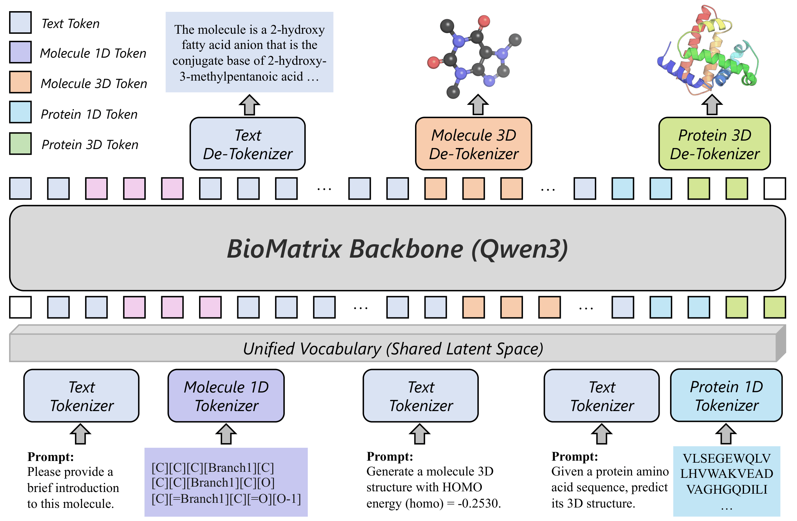

<!-- markdownlint-disable first-line-h1 -->
<!-- markdownlint-disable html -->
<!-- markdownlint-disable no-duplicate-header -->

<div align="center">
  
</div>
<hr>
<div align="center" style="line-height: 1;">
  <a href="https://github.com/QizhiPei/BioMatrix/blob/main/biomatrix_tech_report"><b>Paper Link</b> 📄</a> &nbsp;|&nbsp;
  <a href="https://github.com/QizhiPei/BioMatrix"><b>GitHub</b> 💻</a> &nbsp;|&nbsp;
  <a href="https://huggingface.co/collections/QizhiPei/biomatrix"><b>Models & Data</b> 🤗</a>
</div>
<br>
<div align="center" style="line-height: 1;">
  <a href="https://github.com/QizhiPei/BioMatrix/blob/main/LICENSE"></a>
  <a href="https://huggingface.co/collections/QizhiPei/biomatrix"></a>
</div>

## Table of Contents

1. [Introduction](#1-introduction)
2. [Model Summary](#2-model-summary)
3. [Model Downloads](#3-model-downloads)
4. [Quick Start](#4-quick-start)
5. [Molecule Structure Tokenizer (MolStructTok)](#5-molecule-structure-tokenizer-molstructok)
6. [Protein Structure Tokenizer (GCP-VQVAE)](#6-protein-structure-tokenizer-gcp-vqvae)
7. [License](#7-license)
8. [Citation](#8-citation)
9. [Contact](#9-contact)

## 1. Introduction

We present **BioMatrix**, a multimodal foundation model that natively integrates 1D sequences, 3D structures, and natural language for both molecules and proteins within a single decoder-only architecture. BioMatrix maps molecular 1D sequences (SMILES and SELFIES), molecular 3D structures, protein 1D sequences, protein 3D structures, and natural language into a shared discrete token space through a unified tokenization scheme, so that all modalities are consumed and produced uniformly under a single next-token prediction objective — without external encoders, projection adapters, or modality-specific output heads.

Built upon Qwen3 (1.7B and 4B), BioMatrix is continually pretrained on **304.4 billion tokens** spanning general and domain-specific text, molecular and protein data in both 1D and 3D forms, and cross-modal corpora that interleave biomolecular entities with scientific text and link distinct entities through molecule–protein and protein–protein interaction data. After instruction tuning on a comprehensive suite of downstream tasks covering **80 tasks across 6 categories**, BioMatrix achieves state-of-the-art or competitive performance on **77 out of 80 tasks**, demonstrating that a single, natively multimodal generalist model can effectively match or surpass specialized approaches across a wide range of biological tasks.

<p align="center">
  
</p>

## 2. Model Summary

---

**Architecture: Unified Multimodal Tokenization**

- BioMatrix consolidates molecular 1D sequences (SMILES and SELFIES), protein 1D sequences, molecular and protein 3D structures, and natural language into a single shared discrete vocabulary, enabling all modalities to be handled uniformly under one next-token prediction objective.
- Molecular 3D structures are tokenized via an improved MolStrucTok with a branch-decoupled decoder (512-entry codebook); protein 3D structures are tokenized via GCP-VQVAE (4,096-entry codebook).
- A description-based embedding initialization grounds every newly added token in the pretrained Qwen3 embedding space before continual pretraining begins.

---

**Continual Pretraining: 304.4B Tokens across Modalities**

- The pretraining corpus spans four categories: general and scientific text, molecule-centric data (PubChem, MolTextNet, etc.), protein-centric data (UniRef50, RCSB PDB, UniProt/Swiss-Prot, AFDB, etc.), and cross-entity interleaved data (interleaved biomedical text, molecule–protein and protein–protein interaction data).
- Stochastic composition and three-view instance patterns prevent the model from overfitting to any fixed input schema and encourage joint learning across heterogeneous representations.
- Training is conducted on 64 NVIDIA H100 GPUs using the LLaMA-Factory framework.

---

**Instruction Tuning: 80 Tasks across 6 Categories**

- The instruction-tuning corpus covers three entity scopes (molecule, protein, interaction) × two modality levels (1D sequence, 3D structure), totaling 80 tasks including unconditional generation, property prediction, captioning, synthesis, editing, optimization, folding, inverse folding, binding affinity prediction, and more.
- Prompt template diversification is applied per sub-task to improve robustness to paraphrased instructions at inference time.

---

## 3. Model Downloads

<div align="center">

| **Model** | **Base Model** | **#Params** | **Download** |
| :---: | :---: | :---: | :---: |
| BioMatrix-1.7B-CPT | Qwen3-1.7B | 1.7B | [🤗 Hugging Face](https://huggingface.co/QizhiPei/BioMatrix-1.7B-CPT) |
| BioMatrix-4B-CPT | Qwen3-4B | 4B | [🤗 Hugging Face](https://huggingface.co/QizhiPei/BioMatrix-4B-CPT) |
| BioMatrix-1.7B-SFT | Qwen3-1.7B | 1.7B | [🤗 Hugging Face](https://huggingface.co/QizhiPei/BioMatrix-1.7B-SFT) |
| BioMatrix-4B-SFT | Qwen3-4B | 4B | [🤗 Hugging Face](https://huggingface.co/QizhiPei/BioMatrix-4B-SFT) |

</div>

> [!NOTE]
> CPT = Continual Pretrained (base model); SFT = Supervised Fine-Tuned (instruction-tuned model). All models share the same unified tokenization scheme and vocabulary. For practical use, we recommend the SFT variants.

The SFT training data is also publicly available:

<div align="center">

| **Dataset** | **Download** |
| :---: | :---: |
| BioMatrix-SFT | [🤗 Hugging Face](https://huggingface.co/datasets/QizhiPei/BioMatrix-SFT) |

</div>

## 4. Quick Start

### Requirements

BioMatrix requires **PyTorch** and **transformers >= 4.51.0**.

```bash
pip install torch transformers>=4.51.0
```

### Inference Example

```python
from transformers import AutoModelForCausalLM, AutoTokenizer

model_name = "QizhiPei/BioMatrix-4B-SFT"
tokenizer = AutoTokenizer.from_pretrained(model_name, trust_remote_code=True)
model = AutoModelForCausalLM.from_pretrained(
    model_name,
    torch_dtype="auto",
    device_map="auto",
    trust_remote_code=True
)

# Example: Molecule captioning with SELFIES input
instruction = "I need a brief explanation of the molecule denoted in this SELFIES notation. <|mol_sfi_start|>[Te]<|mol_sfi_end|>"

messages = [
    {"role": "user", "content": instruction}
]
prompt = tokenizer.apply_chat_template(
    messages,
    tokenize=False,
    add_generation_prompt=True
)

inputs = tokenizer(prompt, return_tensors="pt").to(model.device)
outputs = model.generate(**inputs, max_new_tokens=2048, do_sample=False)
response = tokenizer.decode(outputs[0][inputs.input_ids.shape[1]:], skip_special_tokens=False)
print(response)
```

> [!TIP]
> BioMatrix models are also compatible with [vLLM](https://github.com/vllm-project/vllm) and [SGLang](https://github.com/sgl-project/sglang) for efficient inference serving.

## 5. Molecule Structure Tokenizer (MolStructTok)

We provide a self-contained implementation of the **MolStructTok** molecular 3D structure tokenizer under `molstructok/`. This module handles both **tokenization** (3D conformer → discrete VQ codes) and **de-tokenization** (VQ codes → 3D coordinates) independently, without requiring any external dependencies beyond standard packages.

A pre-trained VQ-VAE checkpoint is included at `molstructok/checkpoints/molstructok_vqvae.bin`.

### Installation

```bash
pip install -r molstructok/requirements.txt
```

### Usage

```python
from molstructok import MolStructTok
from rdkit import Chem
from rdkit.Chem import AllChem

# Load the tokenizer with the included pre-trained VQ-VAE checkpoint
tok = MolStructTok(model_path="molstructok/checkpoints/molstructok_vqvae.bin", device="cuda")

# === Tokenization: 3D Mol → struct_sfi tokens ===
# Prepare a molecule with 3D conformer
mol = Chem.MolFromSmiles("c1ccccc1")
mol = Chem.AddHs(mol)
AllChem.EmbedMolecule(mol)
AllChem.MMFFOptimizeMolecule(mol)

mol_renumbered, struct_sfi, token_indices = tok.encode(mol)
print(f"struct_sfi: {struct_sfi}")
# e.g. "[C 42][=C 166][C 70][=C 315][C 158][=C 129][Ring1 -1][=Branch1 -1]..."
print(f"VQ code indices: {token_indices}")
# e.g. [42, 166, 70, 315, 158, 129, ...]

# === De-tokenization: struct_sfi tokens → 3D Mol ===
mol_3d = tok.decode(struct_sfi)
print(f"Reconstructed SMILES: {Chem.MolToSmiles(mol_3d)}")
print(f"3D coordinates:\n{mol_3d.GetConformer().GetPositions()}")
```

### Command-Line Demo

```bash
python -m molstructok.pipeline --model_path molstructok/checkpoints/molstructok_vqvae.bin --device cuda
```

### Package Structure

```
molstructok/
├── __init__.py          # Exports MolStructTok
├── pipeline.py          # Main tokenizer/de-tokenizer pipeline
├── vqvae.py             # VQ-VAE model architecture
├── modules.py           # MLP-Mixer modules
├── descriptors.py       # SE(3)-invariant geometric descriptor extraction
├── reconstruct.py       # 3D coordinate reconstruction from spherical descriptors
├── requirements.txt     # Dependencies
└── checkpoints/
    └── molstructok_vqvae.bin  # Pre-trained VQ-VAE checkpoint
```

## 6. Protein Structure Tokenizer (GCP-VQVAE)

We provide wrapper scripts for the **GCP-VQVAE** protein 3D structure tokenizer under `gcp_vqvae/`. This module handles both **tokenization** (PDB/CIF → VQ indices) and **de-tokenization** (VQ indices → reconstructed PDB) using the GCP-VQVAE model.

### Prerequisites

GCP-VQVAE depends on the [`vq_encoder_decoder`](https://github.com/mahdip72/vq_encoder_decoder) codebase and the pre-trained model checkpoint. Set up the environment as follows:

```bash
# Clone the official vq_encoder_decoder codebase and checkout the required commit
git clone https://github.com/mahdip72/vq_encoder_decoder.git
cd vq_encoder_decoder
git checkout 953892be5c34d2e015498c58aeab261fe75d9fca
cd ..

# Install dependencies following the instructions in the vq_encoder_decoder repository

# Download the pre-trained GCP-VQVAE Large checkpoint
# (following the official vq_encoder_decoder README):
# https://mailmissouri-my.sharepoint.com/:u:/g/personal/mpngf_umsystem_edu/EaxLj74pK5BArOpPkF9MkDgBHxlfaDpAElPRiwH9BsIedA?e=34ida8
# After extraction, the model directory should contain:
# config_vqvae.yaml, config_gcpnet_encoder.yaml,
# config_geometric_decoder.yaml, and checkpoints/best_valid.pth
```

### Tokenization: PDB/CIF → VQ Indices

Encode protein 3D structures into discrete VQ codes. The script merges the PDB/CIF → H5 conversion and H5 → VQ encoding steps into a single command:

```bash
python -m gcp_vqvae.encode \
    --input     /path/to/structures/          \
    --output    /path/to/output/               \
    --model_dir /path/to/vqvae3d_ckpt/large    \
    --vq_code_dir /path/to/vq_encoder_decoder
```

- `--input`: path to a single PDB/CIF file or a directory containing structure files.
- `--output`: output directory where `vq_indices.csv` will be saved.
- `--model_dir`: path to the pre-trained GCP-VQVAE model directory.
- `--vq_code_dir`: path to the `vq_encoder_decoder` source directory.

The output `vq_indices.csv` contains three columns: `pid` (protein ID), `indices` (space-separated VQ code indices), and `protein_sequence` (amino acid sequence).

### De-tokenization: VQ Indices → PDB

Reconstruct backbone PDB files from VQ indices:

```bash
python -m gcp_vqvae.decode \
    --input     /path/to/vq_indices.csv         \
    --output    /path/to/output/                  \
    --model_dir /path/to/vqvae3d_ckpt/large       \
    --vq_code_dir /path/to/vq_encoder_decoder
```

Reconstructed PDB files (backbone N/CA/C atoms) will be saved in `<output>/<timestamp>/pdb_files/`.

### Package Structure

```
gcp_vqvae/
├── __init__.py          # Package init
├── encode.py            # Tokenization: PDB/CIF → VQ indices CSV
└── decode.py            # De-tokenization: VQ indices CSV → PDB files
```

## 7. License

This code repository and the model weights are licensed under [the Apache License 2.0](LICENSE).

## 8. Citation

```bibtex
@article{pei2025biomatrix,
  title={BioMatrix: Towards a Comprehensive Biological Foundation Model Spanning the Modality Matrix of Sequences, Structures, and Language},
  author={Pei, Qizhi and Zhou, Zhimeng and Duan, Yi and Zhao, Yiyang and He, Liang and Hsieh, Chang-Yu and He, Conghui and Yan, Rui and Wu, Lijun},
  year={2025}
}
```
